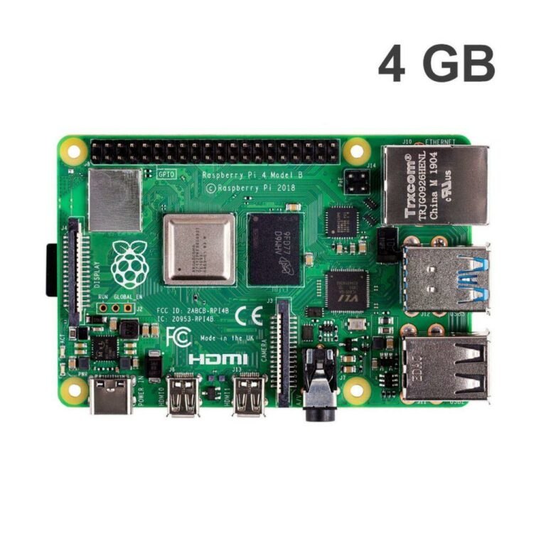
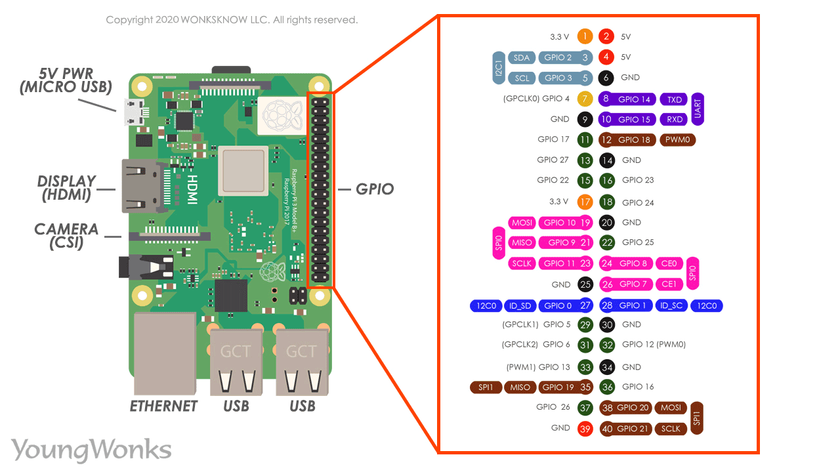
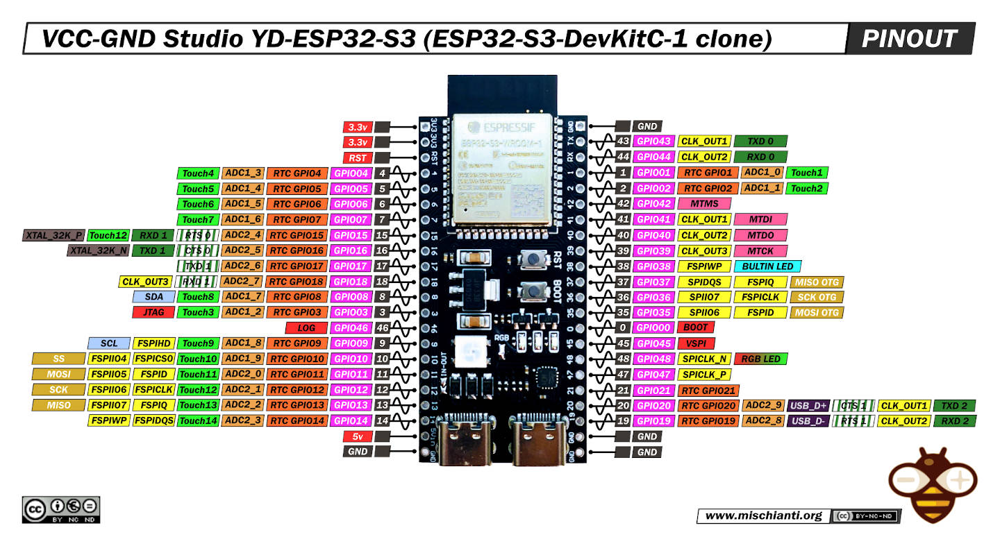

# Viết bài tập thí nghiệm học phần Chuyên Đề IoT của giảng viên Cao Văn Kiên

Nền tảng:

- Phần cứng: Raspberry Pi 4 nhưng thiếu kinh phí dùng ESP32 S3 Devkit C1

- Phần mền: Python3 trên Raspberry Pi 4 thay thế bằng Micropython trên ESP32 S3 Devkit C1

Kết quả: Dùng để kham khảo logic viết mản nguồn bằng python để dễ thao tác trên Python3 trên Raspberry

Giới thiệu:

- Raspberry Pi 4 (Model B)



- Pin out Raspberry Pi 4 (Model B)



- Mạch thay thế ESP32 S3 Devkit C1



Chương 1:

## Bài tập củng cố 

### Bài 1: Lập trình Python trên Linux, viết chương trình cho phép người sử dụng nhập vào từ bàn phím hai con số và in ra màn hình giá trị tổng của hai con số đó. 

- Chương trình theo 2 cách: không sử dụng chương trình con và sử dụng chương trình con

Hướng dẫn giải 

- Mã nguồn

```python
print("Cách 1: không dùng hàm con")
a = int(input("Nhập hệ số thứ nhất: "))
b = int(input("Nhập hệ số thứ hai : "))
print(f"Tổng của {a} + {b} = {a + b}")
print("Cách 2: sử dụng hàm con")
def sum(a, b):
    return a + b
x = int(input("Nhập hệ số thứ nhất: "))
y = int(input("Nhập hệ số thứ hai : "))
print(f"Tổng của {x} + {y} = {sum(x, y)}")
# f"" là kiểu formatted string line: nhúng biểu thức trực tiếp bên trong chuỗi thông qua {}
```

- Lưu đồ giải thuật:

### Bài 2: Lập trình Python trên Linux, viết chương trình cho phép người sử dụng nhập vào từ bàn phím hai chuỗi ký tự bất kỳ, chuỗi ký tự phải có ít nhất 5 ký tự khác nhau). In ra màn hình các kết quả sau: 

- Ký tự có số lần lặp lại nhiều nhất, số lần lặp lại của ký tự này (ở chuỗi thứ nhất và thứ hai)

- Ký tự có số lần lặp lại ít nhất , số lần lặp lại của ký tự này (ở chuỗi thứ nhất và thứ hai)

- Lưu ý: nếu có nhiều hơn một ký tự cho mỗi trường hợp trên thì sẽ in ra màn hình ngẫu nhiên một trong các ký tự đó.

Hướng dẫn giải

- Mã nguồn

```python

import random

def String_has_five_diff_char(string):
    count = 0
    array = []
    for i in string:
        if i not in array:
            array.append(i)
            count += 1
        if count >= 5:
            return True
    return False

def find_loop(string):
    array = [0] * 256
    for char in string:
        array[ord(char)] += 1
    character_max = []
    character_min = []
    counter = [0, len(string) + 1]
    for i in range(256):
        if array[i] > counter[0]:
            counter[0] = array[i]
            character_max = [chr(i)]
        elif array[i] == counter[0]:
            character_max.append(chr(i))
        if array[i] > 0 and array[i] < counter[1]:
            counter[1] = array[i]
            character_min = [chr(i)]
        elif array[i] == counter[1]:
            character_min.append(chr(i))
    return random.choice(character_max), counter[0], random.choice(character_min), counter[1]

array = []
index = 2

while len(array) < index:
    string_index = input(f"Nhập chuỗi {len(array) + 1}: ")
    if not String_has_five_diff_char(string_index):
        print("Chuỗi này chưa có 5 ký tự khác nhau. Vui lòng nhập lại.")
    else:
        array.append(string_index)

for i, string in enumerate(array):
    print(f"Chuỗi {i + 1}: {string}")
    print(f"Ký tự lập lại nhiều nhất là {find_loop(string)[0]} với số lần lập là {find_loop(string)[1]}")
    print(f"Ký tự lập lại ít nhất là {find_loop(string)[2]} với số lần lập là {find_loop(string)[3]}")

```

- Lưu đồ giải thuật

## Thí nghiệm

### Mức độ 1 (3 điểm): Viết chương trình điều khiển 1 LED đơn bất kỳ hoạt động theo chu kỳ sau:
- LED: sáng 1s, tắt 3s; 

<p style="color:red;">Demo mã nguồn sẽ dùng micropython để viết thay thế python3 với gpiozero đều giống nhau về logic nhưng khác nhau về cú pháp nên hãy kham khảo logic thay vì tất cả mã nguồn</p>

Hướng dẫn giải 

- Mã nguồn

```python

import esp
esp.osdebug(0)
from machine import Pin, PWM
from time import sleep
from sys import exit

def set_level_gpio_output(gpio, state):
    if not ((1 <= gpio <= 21) or (35 <= gpio <= 45) or gpio in [47, 48]):
        print("Hãy nhập GPIO NUMBER từ 1 - 21, 35 - 45, 47, 48")
        exit()
    if state not in (0, 1, False, True):
        print("Hãy nhập GPIO LEVEL là 0 (False) và 1 (True)")
        exit()
    gpio_t = Pin(gpio, Pin.OUT)
    if state in (0, False):
        gpio_t.value(1)
    elif state in (1, True):
        gpio_t.value(0)

while True:
    set_level_gpio_output(4, True)
    sleep(1)
    set_level_gpio_output(4, False)
    sleep(3)

```

- Lưu đồ giải thuật

### Mức độ 2 (7 điểm): Điều khiển 2 LED đơn bất kỳ hoạt động như sau. Số thứ tự tương ứng với nhóm (1 chương trình) 

- Nhóm 1:  LED 1: sáng 1s, tắt 3s; lặp lại           LED 2: Sáng khi nhấn nút, tắt khi không nhấn nút sau 2s

- Nhóm 2:  LED 1: sáng 4s, tắt 7s; lặp lại           LED 2: Sáng khi nhấn nút, tắt khi không nhấn nút sau 2s

- Nhóm 3:  LED 1: sáng 3s, tắt 8s; lặp lại           LED 2: Sáng khi nhấn nút, tắt khi không nhấn nút sau 2s

- Nhóm 4:  LED 1: sáng 2s, tắt 5s; lặp lại           LED 2: Sáng khi nhấn nút, tắt khi không nhấn nút sau 2s

- Nhóm 5:  LED 1: sáng 2s, tắt 9s; lặp lại           LED 2: Sáng khi nhấn nút, tắt khi không nhấn nút sau 2s

- Nhóm 6:  LED 1: sáng 3s, tắt 2s; lặp lại           LED 2: Tắt khi nhấn nút, sáng khi không nhấn nút sau 2s

- Nhóm 7:  LED 1: sáng 4s, tắt 3s; lặp lại           LED 2: Tắt khi nhấn nút, sáng khi không nhấn nút sau 2s

- Nhóm 8:  LED 1: sáng 7s, tắt 4s; lặp lại           LED 2: Tắt khi nhấn nút, sáng khi không nhấn nút sau 2s

- Nhóm 9:  LED 1: sáng 3s, tắt 5s; lặp lại           LED 2: Tắt khi nhấn nút, sáng khi không nhấn nút sau 2s

- Nhóm 10: LED 1: sáng 4s, tắt 4s; lặp lại           LED 2: Tắt khi nhấn nút, sáng khi không nhấn nút sau 2s

<p style="color:red;">Demo mã nguồn sẽ dùng micropython để viết thay thế python3 với gpiozero đều giống nhau về logic nhưng khác nhau về cú pháp nên hãy kham khảo logic thay vì tất cả mã nguồn</p>

Hướng dẫn giải

- Mã nguồn 

```python

import esp
esp.osdebug(0)
from machine import Pin, PWM
from time import sleep, sleep_us, sleep_ms
from sys import exit
import _thread

def set_level_gpio_output(gpio, state):
    if not ((1 <= gpio <= 21) or (35 <= gpio <= 45) or gpio in [47, 48]):
        print("Hãy nhập GPIO NUMBER từ 1 - 21, 35 - 45, 47, 48")
        exit()
    if state not in (0, 1, False, True):
        print("Hãy nhập GPIO LEVEL là 0 (False) và 1 (True)")
        exit()
    gpio_t = Pin(gpio, Pin.OUT)
    if state in (0, False):
        gpio_t.value(1)
    elif state in (1, True):
        gpio_t.value(0)

def get_level_gpio_input(gpio):
    if not ((1 <= gpio <= 21) or (35 <= gpio <= 45) or gpio in [47, 48]):
        print("Hãy nhập GPIO NUMBER từ 1 - 21, 35 - 45, 47, 48")
        exit()
    gpio_t = Pin(gpio, Pin.IN, Pin.PULL_DOWN)
    return gpio_t.value()

def button_callback():
    while True:
        if get_level_gpio_input(8) == 1:
            print("ON")
            set_level_gpio_output(5, True)
            sleep(2)
            set_level_gpio_output(5, False)

def led_callback():
    while True:
        set_level_gpio_output(4, True)
        sleep(1)
        set_level_gpio_output(4, False)
        sleep(3)

while True:
    _thread.start_new_thread(led_callback, ())
    button_callback()

```

- Lưu đồ giải thuật

### Mức độ 3 (10 điểm): Viết chương trình điều khiển 8 LED sáng tắt (chu kỳ 1s) theo yêu cầu sau:

- Nhóm 1,7: Sáng lần lượt từ trái qua phải -> lặp lại: 0000 0000 -> 1000 0000 -> 1100 0000 -> … 1111 1111 -> 0000 0000 -> ….

- Nhóm 2: Sáng lần lượt từ phải qua trái -> lặp lại: 0000 0000 -> 0000 0001 -> 0000 0011 -> … 1111 1111 -> 0000 0000 -> ….

- Nhóm 3,8: Sáng lần lượt từ ngoài vào trong -> lặp lại: 0000 0000 -> 1000 0001 -> 1100 0011 -> … 1111 1111 -> 0000 0000 -> ….

- Nhóm 4: Sáng lần lượt từ trong ra ngoài -> lặp lại: 0000 0000 -> 0001 1000 -> 0011 1100 -> … 1111 1111 -> 0000 0000 -> ….

- Nhóm 5: Sáng theo mã nhị phân tăng dần 1 đơn vị, xen kẽ chớp tắt -> lặp lại. 0000 0000 -> tắt -> 0000 0001 -> tắt led -> 0000 0010 -> tắt -> …. -> 1111 1111 -> tắt -> 0000 0000 ->…

- Nhóm 6,9: Sáng theo mã nhị phân giảm dần 1 đơn vị, xen kẽ chớp tắt -> lặp lại. 1111 1111 -> tắt -> 1111 1110 -> tắt led -> 1111 1101 -> tắt -> …. -> 0000 0000 -> tắt -> 1111 1111 ->…

<p style="color:red;">Demo mã nguồn sẽ dùng micropython để viết thay thế python3 với gpiozero đều giống nhau về logic nhưng khác nhau về cú pháp nên hãy kham khảo logic thay vì tất cả mã nguồn</p>

Hướng dẫn giải

- Mã nguồn 

    - Nhóm 1, 7:

```python

import esp
esp.osdebug(0)
from machine import Pin, PWM
from time import sleep, sleep_us, sleep_ms
from sys import exit

def set_level_gpio_output(gpio, state):
    # state with 0: ON, 1: OFF
    if not ((1 <= gpio <= 21) or (35 <= gpio <= 45) or gpio in [47, 48]):
        print("Hãy nhập GPIO NUMBER từ 1 - 21, 35 - 45, 47, 48")
        exit()
    if state not in (0, 1):
        print("Hãy nhập GPIO LEVEL là 0 (False) và 1 (True)")
        exit()
    gpio_t = Pin(gpio, Pin.OUT)
    if state in (0, 1):
        gpio_t.value(state) 

def check_state(dec, hex):
    if(dec & hex):
        return 0
    return 1

count = 255

print("Nhóm 1, 7")

while True:
    set_level_gpio_output(4, check_state(count, 128))
    set_level_gpio_output(5, check_state(count, 64))
    set_level_gpio_output(6, check_state(count, 32))
    set_level_gpio_output(7, check_state(count, 16))
    set_level_gpio_output(15, check_state(count, 8))
    set_level_gpio_output(16, check_state(count, 4))
    set_level_gpio_output(17, check_state(count, 2))
    set_level_gpio_output(18, check_state(count, 1))
    print(f"{check_state(count, 1)} {check_state(count, 2)} {check_state(count, 4)} {check_state(count, 8)} {check_state(count, 16)} {check_state(count, 32)} {check_state(count, 64)} {check_state(count, 128)}")
    sleep(1)
    count -= 1
    if count < 0:
        print("END")
        count = 255
        
```

- Lưu đồ giải thuật